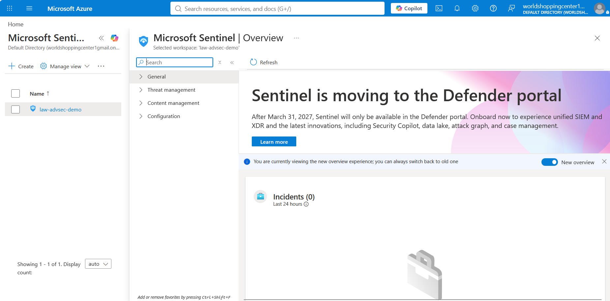
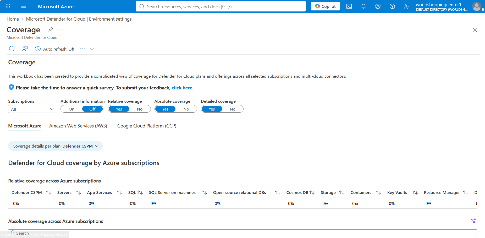
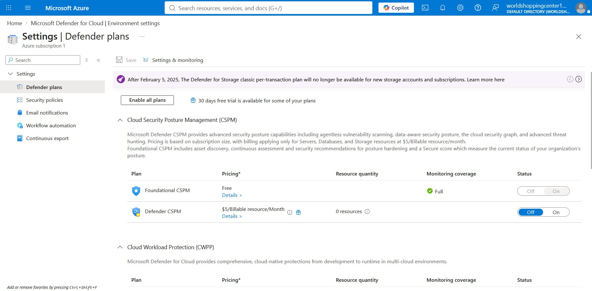
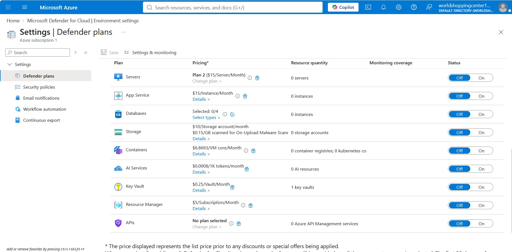
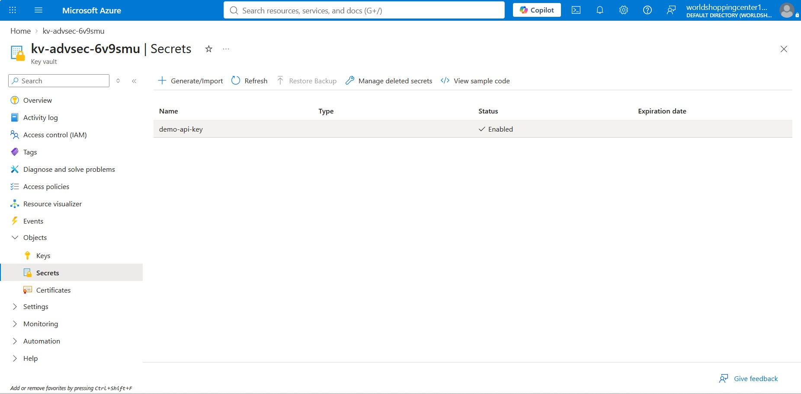

# Implementing Advanced Security Solutions

## Status: Complete ✅

## Overview

This project stands up Azure's core security tooling stack using Terraform:

- **Microsoft Defender for Cloud** — cloud security posture management and
  threat protection, pinned to the **Free tier** across VMs, Storage
  Accounts, and Key Vaults
- **Microsoft Sentinel** — cloud-native SIEM, onboarded onto a dedicated
  Log Analytics workspace with a **daily ingestion cap** to keep costs
  near-zero
- **Defender-to-Sentinel data connector** — streams security alerts (not
  raw logs) from Defender for Cloud into Sentinel at no additional
  ingestion cost
- **Azure Key Vault** — secret management, with an access policy scoped to
  the deploying identity

## Cost design decisions

| Resource | Cost control |
|---|---|
| Log Analytics Workspace | `daily_quota_gb = 0.5` — hard caps ingestion regardless of what connects to it |
| Defender for Cloud | Explicitly pinned to `Free` tier for every resource type declared, rather than left to default (which can silently enable paid plans) |
| Sentinel data connector | Uses the Defender for Cloud alert connector, which streams alerts rather than logs — no meaningful ingestion cost |
| Key Vault | Standard tier, purge protection **disabled** so it can be fully destroyed during teardown (soft-delete still applies per Azure's requirements, with a 7-day retention) |

## Deployment notes (real troubleshooting)

`terraform apply` initially failed on the Sentinel-to-Defender data
connector with:

```
Error: checking for existing Data Connector ... "Workspace 'law-advsec-demo'
is not onboarded to Microsoft Sentinel."
```

This was a race condition — Terraform attempted to create the data
connector before the `azurerm_sentinel_log_analytics_workspace_onboarding`
resource had fully finished registering on Azure's backend, even though
both were declared in the same apply. The fix was an explicit
`depends_on`:

```hcl
resource "azurerm_sentinel_data_connector_azure_security_center" "asc_connector" {
  name                       = "defender-for-cloud-connector"
  log_analytics_workspace_id = azurerm_log_analytics_workspace.law.id

  depends_on = [azurerm_sentinel_log_analytics_workspace_onboarding.sentinel]
}
```

Re-running `terraform apply` after that change picked up exactly where it
left off (Terraform's state already had the other 10 resources), created
the connector, and completed cleanly.

## Screenshots

### Microsoft Sentinel — Overview

Workspace `law-advsec-demo` onboarded to Sentinel, 0 incidents in the last
24 hours.

### Microsoft Defender for Cloud — Overview

100% secure score, 0 critical recommendations — confirms a clean baseline
before any paid plans were considered.

### Defender Plans — CSPM upsell declined

Azure prompted to enable Defender CSPM (a paid plan, $5/billable
resource/month). Declined — Foundational CSPM's free tier already
provides full monitoring coverage for this project's scope.

### Defender Plans — full pricing table, all paid plans Off

Every paid Defender plan (Servers, App Service, Databases, Storage,
Containers, AI Services, Key Vault, Resource Manager, APIs) confirmed
**Off**, matching the Terraform configuration's explicit `tier = "Free"`
settings.

### Key Vault — Secret confirmed

`demo-api-key` created and shown **Enabled** in the vault's Secrets blade.

## Teardown

**Important — Sentinel/Log Analytics billing does not stop at zero when
idle the way some services do; ingested data has a retention cost even
after the workspace exists doing nothing.** Tear down promptly once
documentation is captured:

```bash
terraform destroy
```

Confirm with `y` when prompted. After it completes, verify nothing
lingers:

```bash
az resource list --resource-group rg-advanced-security-demo -o table
```

This should return empty once the resource group itself is deleted.

## Next steps (if extended)

- Add a Sentinel **analytics rule** to generate a sample incident from the
  connected Defender alerts
- Add Azure Activity Log as a second, low-volume data connector
- Explore Defender's **Recommendations** to remediate any flagged
  misconfigurations in the demo resource group itself
